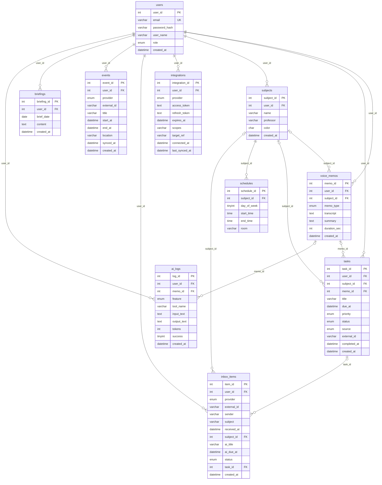

# ERD

```mermaid
erDiagram
    users ||--o{ ai_logs : "user_id"
    voice_memos |o--o{ ai_logs : "memo_id"
    users ||--o{ briefings : "user_id"
    users ||--o{ events : "user_id"
    users ||--o{ inbox_items : "user_id"
    subjects |o--o{ inbox_items : "subject_id"
    tasks |o--o{ inbox_items : "task_id"
    users ||--o{ integrations : "user_id"
    subjects ||--o{ schedules : "subject_id"
    users ||--o{ subjects : "user_id"
    users ||--o{ tasks : "user_id"
    subjects |o--o{ tasks : "subject_id"
    voice_memos |o--o{ tasks : "memo_id"
    users ||--o{ voice_memos : "user_id"
    subjects |o--o{ voice_memos : "subject_id"
    ai_logs {
        int log_id PK
        int user_id FK
        int memo_id FK
        enum feature
        varchar tool_name
        text input_text
        text output_text
        int tokens
        tinyint success
        datetime created_at
    }
    briefings {
        int briefing_id PK
        int user_id FK
        date brief_date
        text content
        datetime created_at
    }
    events {
        int event_id PK
        int user_id FK
        enum provider
        varchar external_id
        varchar title
        datetime start_at
        datetime end_at
        varchar location
        datetime synced_at
        datetime created_at
    }
    inbox_items {
        int item_id PK
        int user_id FK
        enum provider
        varchar external_id
        varchar sender
        varchar subject
        datetime received_at
        int subject_id FK
        varchar ai_title
        datetime ai_due_at
        enum status
        int task_id FK
        datetime created_at
    }
    integrations {
        int integration_id PK
        int user_id FK
        enum provider
        text access_token
        text refresh_token
        datetime expires_at
        varchar scopes
        varchar target_ref
        datetime connected_at
        datetime last_synced_at
    }
    schedules {
        int schedule_id PK
        int subject_id FK
        tinyint day_of_week
        time start_time
        time end_time
        varchar room
    }
    subjects {
        int subject_id PK
        int user_id FK
        varchar name
        varchar professor
        char color
        datetime created_at
    }
    tasks {
        int task_id PK
        int user_id FK
        int subject_id FK
        int memo_id FK
        varchar title
        datetime due_at
        enum priority
        enum status
        enum source
        varchar external_id
        datetime completed_at
        datetime created_at
    }
    users {
        int user_id PK
        varchar email UK
        varchar password_hash
        varchar user_name
        enum role
        datetime created_at
    }
    voice_memos {
        int memo_id PK
        int user_id FK
        int subject_id FK
        enum memo_type
        text transcript
        text summary
        int duration_sec
        datetime created_at
    }
```
